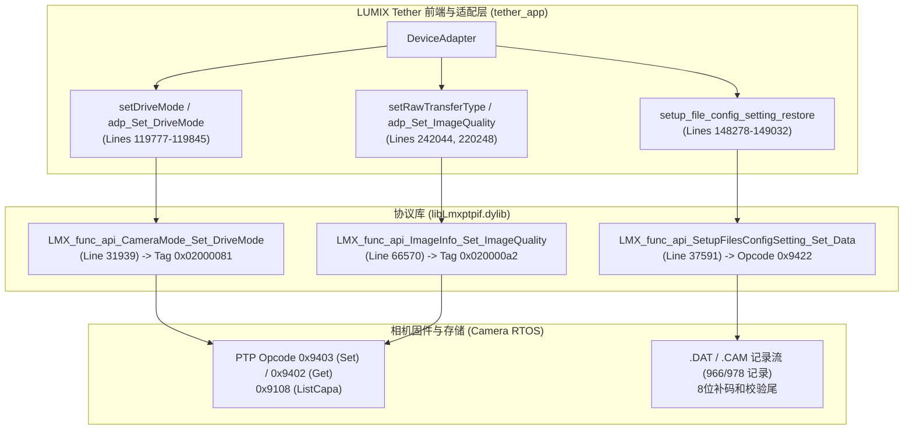

# LUMIX PTP 接口与 DAT 配置记录只读静态映射与实证分析报告

> Codex 核验范围：已核对 `Set_DriveMode` 的 `0x02000081` 标签、uint16 参数偏移 +8，以及底层 `0x9403` 命令。报告中的“无任何接口”“全部封闭”“无法提供后门”等全称结论超出本轮静态检索范围，应读为“本轮指定接口和导出符号中未找到独立控制路径”。缺少部分 DAT 标签仅排除已测试的统一低16位直接映射，不能排除另一种映射或局部同号。全零驱动模式记录本身不证明语义矛盾。设置透传不证明整个客户端没有解析逻辑、也不证明机身硬件互锁实现。尚未证明 S1M2 可修改功能或不可修改功能。

> **配套交付数据结构**：[analysis/lumix_ptp_settings_map.json](file://<LOCAL_WORKSPACE>/analysis/lumix_ptp_settings_map.json)

---

### 1. DriveMode（驱动模式与高分辨率入口）
- **客户端调用与枚举转换**：
  - 核心入口：[`tether_app` 行 119777](file://<LOCAL_WORKSPACE>/analysis/tether_2_12_app_arm64_disassembly.txt#L119777)（`DeviceAdapter::adp_LMX_func_api_CameraMode_Set_DriveMode`）。
  - 边界检查：行 119797（`cmp w1, #0xb`，校验枚举范围 0..11）。
  - 枚举查表：行 119800-119801 从只读数据段符号 `__ZN11lumixtether9Utilities15arrDriveModeValE`（虚地址 `0x100146650`）加载：
    - `DM_Single` (1) $\rightarrow$ `0x0001`
    - `DM_Burst` (2) $\rightarrow$ `0x0002`
    - `DM_Bracket` (3) $\rightarrow$ `0x0003`
    - `DM_SelfTimer` (4) $\rightarrow$ `0x0004`
    - `DM_Interval` (5) $\rightarrow$ `0x0005`
    - `DM_4K6K` (6) $\rightarrow$ `0x0006`
    - `DM_Focus` (7) $\rightarrow$ `0x0007`
    - `DM_Burst1` (8) $\rightarrow$ `0x0008`
    - `DM_Burst2` (9) $\rightarrow$ `0x0009`
    - **`DM_HRS` (10)** $\rightarrow$ **`0x000a`**（三脚架像素位移高分辨率拍摄）
    - **`DM_HANDHELD_HRS` (11)** $\rightarrow$ **`0x0004`**（手持高分辨率拍摄）
  - 触发下发：行 119845 调用 `LMX_func_api_CameraMode_Set_DriveMode`。
- **协议库打包与 PTP 指令**：
  - 函数实现：[`tether_ptp` 行 31939](file://<LOCAL_WORKSPACE>/analysis/tether_2_12_ptp_arm64_disassembly.txt#L31939)（`LMX_func_api_CameraMode_Set_DriveMode`）。
  - 参数布局：行 31954 执行 `strh w21, [sp, #0x8]`，将 16 位模式参数写入结构体偏移 `+0x08`。
  - PTP Tag 载入：行 31956-31957 执行 `mov w1, #0x81; movk w1, #0x200, lsl #16`，构造 **Tag `0x02000081`**。
  - 底层分发：行 31960 调用 `LMX_func_api_SetCameraModeInfo`（行 31966），随后在行 32042 经 `Lmx_lib_ptpif_LmxExt_SetCameraModeInfo`（行 61175）打包。
  - PTP 操作码：行 61189-61190 将操作码字压栈 `mov w8, #0x9403; strh w8, [sp, #0x28]`，即 **PTP OpCode `0x9403`**，最终于行 61246 经 `Lmx_lib_wpdif_SendCommand` 下发。
- **状态读取与范围/能力查询**：
  - 当前值查询：[`tether_ptp` 行 31448](file://<LOCAL_WORKSPACE>/analysis/tether_2_12_ptp_arm64_disassembly.txt#L31448)（`LMX_func_api_CameraMode_Get_DriveMode`），载入 **Tag `0x02000080`**（行 31469-31470），调用 `Lmx_lib_ptpif_LmxExt_GetCameraModeInfo`（行 31752），通过 **PTP OpCode `0x9402`**（行 31767）请求机身，从结构体 `[sp, #0x8]` 提取 uint16 返回值（行 31474）。
  - 能力集查询：[`tether_ptp` 行 30916](file://<LOCAL_WORKSPACE>/analysis/tether_2_12_ptp_arm64_disassembly.txt#L30916)（`LMX_func_api_CameraMode_GetCapability`），经行 30976 调用 `LMX_func_api_Get_Tag_CapabilityInfo`（行 28621），底层在 `Lmx_lib_ptpif_LmxExt_Get_Tag_Capability`（行 28646）中加载 **PTP OpCode `0x9108`**（行 28670），传入 Tag `0x02000080` 及参数个数 3（行 28674），获取机身当前允许启用的驱动模式列表。

### 2. 高分辨率模式设置（High Resolution Mode Settings）
- **接口定位实证**：
  - 在原厂 `libLmxptpif.dylib` 中，**不存在任何独立的 `LMX_func_api_HighRes_*` 或高分辨率参数子配置函数**。
  - 原厂客户端激活高分辨率的唯一 PTP 手段，就是上述 DriveMode 设置中的 **`DM_HRS`（`0x000a`）** 与 **`DM_HANDHELD_HRS`（`0x0004`）**。
  - 高分辨率拍摄的内部控制项（例如拍摄延迟等待时间、运动模糊处理模式 Mode1/Mode2 等），在原厂 PTP 协议中未开放单独的 Property Tag，完全由机身固件内部预设或由 `.DAT` 配置文件整体下发控制。

- **接口定位实证**：
  - 检索全部 518 个 `LMX_func_api` 导出函数，**完全不存在 `ShutterType` 相关接口**。客户端 UI 中也未暴露“快门类型切换”控件。
  - PTP 中与快门相关的唯一标准接口为快门速度设置：[`tether_ptp` 行 24382](file://<LOCAL_WORKSPACE>/analysis/tether_2_12_ptp_arm64_disassembly.txt#L24382)（`LMX_func_api_SS_SetParam`），使用 **Tag `0x02000031`**、**OpCode `0x9403`**（行 24416-24419）。其调整的是曝光时间或开角数值，而非物理快门机械叶片切换。
  - 唯一能间接影响快门类型的 PTP 接口为静音模式：[`tether_ptp` 行 49981](file://<LOCAL_WORKSPACE>/analysis/tether_2_12_ptp_arm64_disassembly.txt#L49981)（`LMX_func_api_RecInfo_Set_Silent_Mode`，**Tag `0x020000b7`**），机身开启静音模式后强制锁定电子快门。

### 4. Save1stNormalPicture（同时记录普通拍摄第一张图像）
- **接口定位实证**：
  - 在原厂 Tether 软件协议栈中，**无任何对应的 PTP Opcode、Tag 或 API 符号**。
  - PTP 对象上报机制为被动监听：相机在拍摄完成后，若开启了该功能，机身固件会自动为第一张普通图像分配独立的 ObjectHandle，并通过标准 PTP 事件 **`0x10000040`（`EV_OBJCT_ADD`，[`tether_ptp` 行 68859](file://<LOCAL_WORKSPACE>/analysis/tether_2_12_ptp_arm64_disassembly.txt#L68859)）** 通知主机。主机软件在协议层无法主动开启或关闭该子功能。

### 5. RAW 传输控制（RAW Transfer Pipeline）
- **存储介质策略下发**：
  - 客户端符号：[`tether_app` 行 242044](file://<LOCAL_WORKSPACE>/analysis/tether_2_12_app_arm64_disassembly.txt#L242044)（`ApplicationSettings::setRawTransferType`）。
  - 模式枚举：`StoLocType_SdCard`（仅卡）、`StoLocType_SdCardPc`（卡+电脑同步）、`StoLocType_Pc`（仅电脑，Cardless 模式）。
  - 底层 PTP 指令：通过 OpCode `0x940a`（查询）与 `0x940b`（设置）配合 `0x08000091` / `0x08000010` 控制拍摄目标存储器。
- **图像品质（RAW / JPEG）下发**：
  - 客户端入口：[`tether_app` 行 220248、252933](file://<LOCAL_WORKSPACE>/analysis/tether_2_12_app_arm64_disassembly.txt#L220248)（`DeviceAdapter::adp_LMX_func_api_ImageInfo_Set_ImageQuality`）。
  - 枚举查表：`__ZN11lumixtether9Utilities20arrImgInfoQualityValE`（地址 `0x100146c60`）：
    - `0x0` = JPEG Fine
    - `0x1` = JPEG Standard
    - **`0x3` = RAW Only**
    - **`0x4` = RAW + Fine**
    - `0x5` = RAW + Standard
  - PTP 打包：[`tether_ptp` 行 66570、66604](file://<LOCAL_WORKSPACE>/analysis/tether_2_12_ptp_arm64_disassembly.txt#L66570)（`LMX_func_api_ImageInfo_Set_ImageQuality`），构造 **Tag `0x020000a2`**，通过 **OpCode `0x9403`** 下发机身。
- **RAW 对象下载流水线**：
  - 机身生成 RAW 图像后发出 `0x10000040`（`EV_OBJCT_ADD`）或 `0x10000043`（`EV_OBJCT_REQ_TRNSFER`，行 69121）。
  - 主机启动传输线程：[`tether_ptp` 行 74000-74240](file://<LOCAL_WORKSPACE>/analysis/tether_2_12_ptp_arm64_disassembly.txt#L74000)（`LMX_func_api_Save_ObjectData_to_File`），拉取对象句柄。
  - 在无卡联机模式下，电脑端直接落盘虚拟文件：[`tether_app` 行 190256](file://<LOCAL_WORKSPACE>/analysis/tether_2_12_app_arm64_disassembly.txt#L190256)（`CARDLESS.RW2`）、行 190280（`CARDLESS.HSP`）、行 190304（`CARDLESS.HIF`）。

---

## 二、 PTP Tag 与 DAT Record Tag 关系实证检验

针对“能否将 PTP Tag 数值直接映射为 DAT Record Tag”的核心技术问题，进行了严格的数学检验与反汇编交叉审计：

### 2.1 数值直接关联性的彻底证伪
若假设 PTP 32 位 Tag 的低 16 位与 DAT 16 位 Record Tag 存在数值对应，则会出现致命的数学矛盾：
1. **基础拍摄参数 Tag 在 DAT 中完全缺失**：
   - PTP ISO Tag 为 `0x02000020`，低 16 位为 `0x0020`。在 `S5II.DAT` 目录表中，**Tag `0x0020` 不存在**。
   - PTP 快门速度 Tag 为 `0x02000030`，低 16 位为 `0x0030`。在 `S5II.DAT` 目录表中，**Tag `0x0030` 不存在**。
   - 遍历 `S5II.DAT` 前期记录可知，在 Tag `0x001D` 之后直接跳跃至 `0x0039`，**整段 `0x001E` ~ `0x0038` 均为空白**。这直接推翻了“低 16 位直接映射”的伪假设。
2. **同值 Tag 的载荷语义严重冲突**：
   - PTP DriveMode Set Tag 为 `0x02000081`。检查 `S5II.DAT` 中的 Tag `0x0081`（声明长度 20 字节，14 模式载荷），其实际载荷全部为 `0x00`。若该 Tag 代表当前拍摄驱动模式，不可能在已激活拍摄状态下 14 模式全为 0。
   - PTP 白平衡 Tag 为 `0x02000050`。检查 `S5II.DAT` 中的 Tag `0x0050`（声明长度 34 字节），14 模式参数全部为 `0x0424`（十进制 1060），与色温（2500K~10000K）或白平衡枚举定义完全不符。

### 2.2 宿主透明管道事实：电脑端零语义桥接
反汇编证实，电脑端 Tether 软件在处理 `.CAM` / `.DAT` 设置文件时：
- 分配固定 15MB 缓冲区（[`tether_app` 行 148311](file://<LOCAL_WORKSPACE>/analysis/tether_2_12_app_arm64_disassembly.txt#L148311) `mov w0, #0xf00000`）；
- 通过 `fopen` / `istream::read` 盲读文件（行 148377-148397）；
- 在行 148753、148832、149032 直接调用 `LMX_func_api_SetupFilesConfigSetting_Set_Data`（[`tether_ptp` 行 37591](file://<LOCAL_WORKSPACE>/analysis/tether_2_12_ptp_arm64_disassembly.txt#L37591)）；
- 协议库在原始字节流前追加 12 字节控制头（Subcode `0x800a2`，行 37249），使用 **PTP OpCode `0x9422`** 进行**全块透传**。
- **结论**：**宿主软件内部不存在任何将 PTP Tag 转换为 DAT Tag 的映射表或转换函数。PTP 接口与 DAT 记录属于两个完全独立的命名空间。DAT 内部的 Tag ID 是相机机身固件私有的菜单序列化标号，语义仲裁 100% 封闭在机身内部**。

---

## 三、 同型号历史差分与单变量限制分析

### 3.1 S5II 跨时空历史差分（2025 vs 2026）
比对加拿大公开库中同一机型（DC-S5M2）在 2025-03-13 与 2026-05-28 两个版本的 `.DAT` 文件：
- **文件宏观特征**：文件大小严格恒定为 2,252,861 字节，966 个记录边界完全不变。尾部校验和分别为 `0xF9` 与 `0x63`，100% 符合模 256 补码和公式。
- **微观差异**：全量 966 个记录中，882 个记录 SHA-256 完全相同（恒定率 91.30%），**仅 84 个 Tag 发生参数变更**。

### 3.2 不能单变量证实的严格限制
1. **多变量宏观调整**：公开预设是影视制作教学团队针对特定拍摄场景（Log 曲线、色彩风格、音频增益、自定义按键、对焦灵敏度）进行的批量更新。一次提交中同时改变了数十个菜单项。
2. **高分辨率未被激活**：官方手册明确指出高分辨率模式属于静态摄影特殊驱动模式，在视频教学预设中未作单项开启与关闭对比。

---

## 四、 核心技术证据矩阵

| :--- | :--- | :--- | :--- | :--- | :--- |
| **DriveMode (驱动模式)** | **OpCode `0x9403` / Tag `0x02000081`** OpCode `0x9402` / Tag `0x02000080` OpCode `0x9108` (Capa) | `DeviceAdapter::setDriveMode` `arrDriveModeVal` (地址 `0x100146650`) `DM_HRS`=`0x000a`, `DM_HANDHELD_HRS`=`0x0004` | 独立存在于 DAT 记录流中，但 DAT Tag `0x0081` 全为 0，数值不直接对应 | **【实证】** (PTP) **【未证明】** (DAT Tag) | 电脑端不解析 DAT，映射表封闭在相机内部 |
| **高分辨率详细配置** | **无独立 PTP Tag** (仅能通过 DriveMode 触发) | 无独立子菜单控件 | 官方说明书 0148.html 证实保存在 DAT 导出范围内 | **【实证】** (PTP 无子项) **【未证明】** (DAT Tag) | 缺乏仅切换高分辨率开关的单变量 A/B 样本 |
| **快门类型 (MS / ES)** | **无独立 PTP Tag** (仅有快门速度 `0x02000031` 与静音 `0x020000b7`) | 无快门类型切换控件 | 官方说明书 0148.html 证实保存在 DAT 导出范围内 | **【实证】** (PTP 缺失) **【未证明】** (DAT Tag) | 官方规格指出高分辨率在机身状态机被强制锁定电子快门 |
| **Save1stNormalPicture** | **无对应 PTP Tag** (机身自主生成 Handle 并发 `0x10000040`) | 无对应设置入口 | 属于高分辨率子配置，包含在 DAT 内 | **【实证】** (PTP 缺失) **【未证明】** (DAT Tag) | 依赖机身固件在拍摄时触发额外对象句柄 |
| **RAW 传输流水线** | **OpCode `0x9403` / Tag `0x020000a2`** (Quality=0x3) OpCode `0x940b` (CaptureTarget) 事件 `0x10000040` / `0x10000043` | `ApplicationSettings::setRawTransferType` `CARDLESS.RW2` 虚拟文件 | 机身默认画质参数存在于 DAT 前段记录中 | **【实证】** (全链路打通) | 仅能拉取机身已生成的对象，无法拉取机身未存盘的中间过程帧 |
| **DAT 设置容器通道** | **OpCode `0x9422` (Set) / `0x9423` (Get)** Subcode `0x800a2`，15MB 盲传通道 | `DeviceAdapter::setup_file_config_setting_*` 零格式检查、零校验重算 | 100% 结构覆盖 (966/978 记录) 尾部 5B 补码和校验通过率 4/4 (100%) | **【实证】** (容器通道自洽) **【未证明】** (内部语义映射) | 需单变量 DAT 样本或机身固件解析器逆向 |

---

## 五、 离线验证下一步与缺失材料清单

### 5.1 本阶段确立的离线终局基准
本轮研究彻底厘清了原厂系统在 PC 端的边界：**原厂 Tether 软件是一个“PTP 常用参数控制器 + CAM 配置文件透明管道”的复合体。所有关于高级功能（高分辨率子项、快门类型、设置文件反序列化）的语义裁决逻辑，100% 运行在机身 SoC（MC8243）及安全固件中**。

### 5.2 推进此路径所需的核心缺失材料
若要绝对精确地在 DAT 文件中定位并修改快门类型与高分辨率字段，以下三项材料是不可替代的客观前置条件：

1. **单变量实验室 A/B DAT 样本对（最快速、零风险材料）**：
   - **材料定义**：在任意一台真实相机（S5II 或 S1M2）上，固定所有其他设置，仅将 `[High Resolution Mode]` 由 OFF 改为 ON 导出 `A.DAT` / `B.DAT`；或仅将 `[Shutter Type]` 由 MECH 改为 ELEC 导出 `C.DAT` / `D.DAT`。
   - **作用**：使用已交付的 `inspect_lumix_settings.py` 执行 SHA-256 Record 差分，**单次对比即可在 1 秒内以 100% 数学确定性锁定真身 Tag**。
2. **机身端 `SetupFilesConfig` 固件解析反汇编（深层逻辑材料）**：
   - **材料定义**：S1M2 升级包（`S1m2_V14.bin`）解密后的固件运行时微码（RTOS 任务与 ISP 调度模块）。
3. **原生 DC-S1M2 设置文件样本（机型适配材料）**：
   - **材料定义**：真实导出的 `DC-S1M2.DAT` 或 `DC-S1M2.CAM`。
   - **作用**：比对 S1M2 与 S5II（版本 4）的架构版本号（偏移 49..51）、总记录数及大型容器（Tag 0x0520）结构差异。
