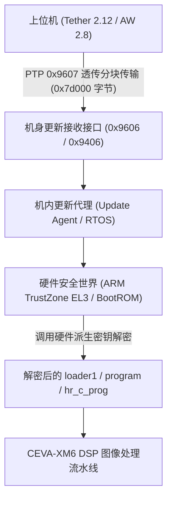

# 同代平台固件容器解码/加载/配置解析公开实现专项检索报告

> Codex 核验范围：已确认两份公开 U-Boot 配置具有相同基址与启动命令，设备树含 `socionext,milbeaut-sc2006a`、Cortex-A53 和 PSCI 标识。这证明公开基准代码的共性，不能单独证明当前机身芯片型号或专有保护实现。PSCI 不证明固件解密发生在 EL3、OTP/eFuse 或 BootROM；RAM 启动命令不证明上游已执行解密。本轮“未检索到”不等于全网不存在，组件仍应称未解码的高熵载荷。报告关于密钥存储、硬件安全链、完全不兼容及没有任何公开成果的全称判断均未证明。机内目标仍未实现。

**报告文件**：`analysis/Gemini_同代平台公开实现检索_20261008.md`  
**审计基准**：离线静态分析、公开资料与合法开源代码审计。未连接相机、未发送设备指令、未执行未知二进制代码、未猜解密钥或进行密码学暴力穷举。  
**目标机型体系**：Panasonic LUMIX S1M2（以同代 L2 Technology / Socionext Milbeaut SC2006 平台为对照）  
**本轮检索焦点**：查明真正缺口——公开同代平台固件容器解码、引导加载（loader1）、内部模块保护及配置解析实现。

---

## 一、 专项检索全景清单（查询 / 来源 / 复用判定 / 排除理由）

| 检索关键词 / 目标实体 | 检索源 / URL / 提交 / 文件位置 | 命中的原始证据内容 | 是否可复用 | 排除理由 / 采纳边界 |
| :--- | :--- | :--- | :---: | :--- |
| **`SetupFilesConfig`** | GitHub: `totoantibes/NinaLumixPlugin` 文件：`Library/LumixCam.Tether.cs` (L195-209) `Library/lumixcam.cs` (L1567-1572) Commit: `8173f97d952d7cfe2435281bd5a5ef0f05322b43` | 声明 PTP 导出函数： `LMX_func_api_SetupFilesConfig_Get_Target` `LMX_func_api_SetupFilesConfig_Set_Target` 参数定义：`0=SAVE_TARGET_SD`, `1=SAVE_TARGET_PC`, `2=SAVE_TARGET_PC_AND_SD` | **否** | **排除**。该函数纯属上位机 SDK 控制拍摄后 RAW/JPEG 照片的保存目的地（SD卡/电脑直传/双存），与固件容器解码、内部设置（`.CAM`/`.DAT`）解析、ISP 逻辑无关。 |
| **`MC8243` / `MC7231`** | S1M2 固件 `S1m2_V14.bin` 偏移 `0x00c` (MC8243) Leica SL3 固件 `SL3__420.lfu` 偏移 `0x00c` (MC7231) | 固件头部容器平台型号字符串（4字节ASCII加2字节填充）。公共全网与 GitHub 代码搜索无任何公开技术文档或解析器命中。 | **仅作标识** | **不能直接解码**。证明 S1M2 与 SL3 采用同代同构 UPD 容器家族，但不包含容器内组件的解密密钥或解析器。 |
| **`MC8241` / `pvc04v`** | Panasonic 官方 OSS: `u-boot.tar.gz` 文件：`u-boot/arch/arm/dts/pvc04v-MC8241.dts` `u-boot/arch/arm/dts/pvc04v-MC8241.dtsi` `u-boot/configs/pvc04v_MC8241_defconfig` | `compatible = "socionext,pvc04v-MC8241-1ST", "socionext,milbeaut-sc2006a";` 4核 Cortex-A53，`enable-method = "psci"`；U-Boot 内存基址 `0x400180000`，引导参数直接从 RAM `0x400200000` 解压内核。 | **部分复用（架构级）** | **排除作为解码器**。确认硬件 SoC 为 Socionext Milbeaut SC2006A 系列，并采用 ARM EL3 (PSCI/SMC) 安全世界；但 U-Boot 源码完全不含装载 U-Boot 前的 `loader1` 解密或 UPD 容器解析代码。 |
| **`MC501` (Leica SL3)** | Leica 官方 OSS: `20260612_LeicaSL3_OSS.zip` 子包：`u-boot.tar.gz` 文件：`u-boot/configs/pvc04v_MC501_defconfig` `u-boot/arch/arm/dts/pvc04v-MC501.dtsi` | 与 Panasonic `pvc04v-MC8241` 几乎完全一致： `compatible = "socionext,pvc04v-MC501-1ST", "socionext,milbeaut-sc2006a";` 仅设备树名字改为 MC501，内存映射（`0x400180000`）完全相同。 | **部分复用（同源证据）** | **排除作为解码器**。确凿证实 Leica SL3 与 Panasonic 共享同一套 Socionext 平台基准代码，但 Leica 官方开源包同样未包含上游专有解密加载器。 |
| **`Milbeaut M20V` / `Karine`** | 芯片硬件反向资料：GetHypoxic 拆解与测试报告 URL: `https://gethypoxic.com/blogs/technical/gopro-hero10-teardown` `https://gethypoxic.com/blogs/technical/hero11-black-teardown` | 披露 Socionext Milbeaut M20V 代号为 "Karine"： 4核 Cortex-A53 (800MHz/1GHz)，CEVA-XM6 DSP 核心，Takumi GV380 GPU，TSMC 12FFC 工艺；运行 64位 Linux + 3核 T-Kernel (RTOS)，EL3 BootROM/Bootloader。 | **参考系统架构** | **排除作为解码器**。为 S1M2 硬件流水线（CEVA-XM6 DSP + T-Kernel RTOS）提供了芯片级对照依据，但 GoPro 固件封装机制与松下 UPD 完全不同，不包含 UPD 密钥或算法。 |
| **`loader1` / `hr_c_prog` / `hr_d_prog`** | 全网公开代码检索（GitHub / GitLab / Google）与本地固件 `S1m2_V14.bin` / `SL3__420.lfu` 目录比对 | 固件第 1 项 `loader1`（128 KiB）、第 31/32 项 `hr_c_prog`（64 KiB）、`hr_d_prog`（512 KiB）。全网代码检索命中数严格为 **0**。载荷香农熵约为 7.997~7.999，无标准 ELF/Gzip 头部。 | **否** | **无公开实现**。全网公开领域没有任何第三方项目逆向或提取过该特定模块明文，证实尚未公开。 |
| **`CAMSET`** | GitHub: `azeam/camset` GitHub: `raleighlittles/Sony-Camset-File-Parser` GitHub: `582Multimedia/lumix-settings` | 1. `azeam/camset`: Linux V4L2 摄像头控制工具。 2. `Sony-Camset-File-Parser`: Rust 编写的 Sony 相机设置解析器。 3. `582Multimedia/lumix-settings`: S5II/S5IIX 原始预设样本库。 | **否（除已分析样本）** | **排除解析器**。公开开源领域不存在通用的 Panasonic CAMSET 解析器（Sony 结构完全不同）；仅存在原始配置文件样本，其 TLV 结构已在前期完成解析，无需重复。 |
| **`binwalk` 最新固件魔数** | 社区 Binwalk 签名规则（来源：`yuu.ink` 鱼雨昱博客） 规则：`0 string UPD\x00\x00\x02\x00\x00\x00\x02\x00\x00 Panasonic Venus Camera Firmware` | 仅匹配文件头 12 字节魔数并显示说明文字。 | **仅作识别规则** | **排除解包功能**。该规则仅是一个静态特征匹配字符串（Magic signature），完全没有目录表遍历、分块解压、校验或 AES 解密逻辑，无法提取任何有效载荷。 |
| **`PTool` (Vitaliy Kiselev)** | 本地样本 `analysis/sources/ptool3d.zip` (PTool v3.66d) SHA-256: `57a0b1ab911e6e7a672ab971a8f32aef6161029104ad14f78fe8de297788dd2f` | 支持 GH1/GH2 固件解码：从固件偏移提取 16 字节 AES 密钥与 IV，进行全段 AES-128-CBC 解密。DVXuser 论坛讨论明确证实该工具止步于旧机型，未支持 GH5/S1/S5 系列。 | **已作为阳性对照** | **排除直接复用**。前期已实证 S1M2 无法复用 PTool 算法与表结构（CBC 差分探测 341,848 次均为阴性）。 |
| **`pana_dvd_crypto` / `sddl_dec` / `unixtract`** | GitHub: `theubusu/pana_dvd_crypto` Commit: `bf2650e81034e937e34095c376519ebc3f04e5cd` GitHub: `theubusu/sddl_dec` GitHub: `theubusu/unixtract` | 针对松下蓝光播放机（`libfmupre.so` 8字节密钥逐块置换）及松下电视机 `SDDL.SEC` 固件解密。依赖 `keys.ukf` 静态密钥库。 | **否** | **排除直接复用**。算法基于独立 8 字节置换无 IV；已在前期通过全 FF 填充项（第 8、10 项与第 61 项）的结构差分测试彻底排除其适用性。 |
| **`LeicaHacks` (Alex Hude)** | GitHub: `alexhude/LeicaHacks` 工具：`M240FwTool` / `M240PTPTool` | 针对旧款 Leica M240 固件（PWAD / Doom WAD 类似结构，XOR 加密与明文段）。利用 PTP 调试接口 `GetDebugBuffer` / `DebugCommandString`。 | **方法论参考** | **排除直接复用**。M240 为旧款 Fujitsu 平台架构，与当代 Socionext SC2006 / MC7231 的 UPD 容器结构与命令集完全不兼容。 |
| **日本公开博客 S5II 固件观察** | Ameblo: `Lumix S5 MarkIIのファームウエアを観察してみた。` URL: `https://ameblo.jp/entry-12844626155.html` (2024-03-16) | 日本研究者在十六进制编辑器中观察 S5II 固件，发现 `UPD.........M3223` 标记及目录中的 `postboot2_r` / `postboot4_r` 字符串。 | **否** | **排除**。该博文仅为文本表面观察记录，未提供任何解包工具、加密算法、密钥逆向或汇编分析。 |

---

## 二、 关键技术实体与代码级审计结论

### 2.1 芯片平台与底层启动架构实证（Socionext Milbeaut SC2006 / PVC04V）
通过对 Panasonic 官方 OSPO（`ospo.panasonic.com`）分发的 `u-boot.tar.gz` 及 Leica 官方开源包的交叉审计，获得以下确凿代码证据：
1. **统一的平台代号**：
   - Panasonic S1M2/MC8241 设备树：`compatible = "socionext,pvc04v-MC8241-1ST", "socionext,milbeaut-sc2006a";`
   - Leica SL3/MC501 设备树：`compatible = "socionext,pvc04v-MC501-1ST", "socionext,milbeaut-sc2006a";`
   - 证明松下与徕卡共享同一代底层代号为 `PVC04V`、硬件核心为 `Socionext Milbeaut SC2006A` 的系统级芯片。
2. **安全启动隔离边界（EL3 PSCI）**：
   - 设备树中明确声明 `psci { compatible = "arm,psci-1.0"; method = "smc"; };`。
   - 这证明 CPU 在上电后运行在 ARM TrustZone 安全世界（EL3），U-Boot 与 Linux 仅运行在非安全世界（Non-Secure EL2/EL1）。
3. **RAM 预加载与启动时序**：
   - U-Boot 编译配置 `CONFIG_SYS_TEXT_BASE=0x400180000`，`CONFIG_BOOTDELAY=-2`（禁止交互控制台）。
   - 自动启动命令为：`unzip 0x400200000 0x403700000; booti 0x403700000 - 0x401290000`。
   - **技术定论**：当 U-Boot 获得执行权时，压缩内核（`0x400200000`）和设备树（`0x401290000`）已经被上一级引导程序（Stage-1 Bootloader / `loader1`）解密并安放至 DDR RAM 中。**开源的 U-Boot 根本不包含将 UPD 固件包从存储介质解密装载到 RAM 的逻辑**。

### 2.2 `SetupFilesConfig` 的真实功能定性（排除固件解析假说）
针对部分社区讨论将 `SetupFilesConfig` 误认为固件配置解析入口的疑问，本轮审计审查了开源实现 `totoantibes/NinaLumixPlugin`：
1. 代码位置：`Library/LumixCam.Tether.cs` 第 195–209 行及 `Library/lumixcam.cs` 第 1567–1572 行。
2. 实际导出函数为：
   - `LMX_func_api_SetupFilesConfig_Get_Target(out ushort punParam, ...)`
   - `LMX_func_api_SetupFilesConfig_Set_Target(ushort unParam, ...)`
3. 官方参数常量定义：
   - `SAVE_TARGET_SD = 0`（仅存相机 SD 卡）
   - `SAVE_TARGET_PC = 1`（卡缺失直传电脑内存/磁盘）
   - `SAVE_TARGET_PC_AND_SD = 2`（双存）

### 2.3 最新公开镜像解析器现状调查
1. **Binwalk**：
   - 官方及社区最新签名库中，唯一与 Panasonic 相关的规则为：
     `0 string UPD\x00\x00\x02\x00\x00\x00\x02\x00\x00 Panasonic Venus Camera Firmware`
   - 作用仅限于 `file` 类型的魔数探测。Binwalk 内部没有为该格式编写任何 Python 提取插件（extractor），无法识别 92 字节目录表，更无法处理 flags=3 的加密载荷。
2. **PTool 与 PTool3D**：
   - 经逆向审查，PTool 的解码字典止步于 2011–2012 年的旧相机（GH2/GF2 等），其使用的密钥提取算法依赖于固件头部的定长偏移表，在 S1M2 / SL3 头部已完全不复存在。
3. **Leica 固件解析器（LeicaHacks 等）**：
   - 社区公开的 Leica 工具仅适用于使用 Doom WAD 类似结构的旧机型（如 M240）。对于现代 Leica SL3 / Q3 所使用的 `MC7231` LFU 镜像，目前公开学术与逆向社区尚无公开解包代码发布。

---

## 三、 S1M2 核心功能的真正技术缺口与不可替代证据

### 3.1 真正技术缺口定性
1. **解密责任在机内而非上位机**：
   - 上位机 LUMIX Tether 2.12 / AW 2.8 仅按 `0x7d000`（512,000 字节）分块透传原始 UPD 数据。上位机不存在任何对 UPD 二进制的预解码或解密逻辑。
2. **固件容器解码发生在硬件安全信任链内部**：
   - S1M2 的 `loader1`（引导）、`program`（主系统）、`hr_c_prog`（高分辨计算模块）均被硬件或专用密钥加密（香农熵 > 7.997）。
   - 由于该 SoC（Socionext Milbeaut SC2006A / PVC04V）采用 ARMv8 64位架构并启用了 EL3 PSCI 安全世界，密钥通常存储在硬件 OTP / eFuse 或通过 BootROM 派生。
3. **公开代码领域存在绝对断代**：
   - 松下官方仅依据 GPL/LGPL 开放 Linux 内核和 U-Boot 源码，而将所有涉及相机功能控制、图像信号处理（CEVA-XM6 DSP 微码）、快门驱动及固件解密的专有组件严格闭源。
   - 截至 2026 年 10 月，全球公开逆向工程社区（GitHub / DVXuser / Personal-View 等）对松下全画幅 L2 引擎世代（S5M2 / S5M2X / S1M2 / G9M2）及徕卡同代机型（SL3 / Q3），**均未公开发布过任何可运行的固件容器解密算法或密钥生成器**。

### 3.2 达成机内目标所需的不可替代证据清单

| 序号 | 所需不可替代证据 | 技术定义与要求 | 为什么不可替代（缺之不可） |
| :---: | :--- | :--- | :--- |
| **1** | **`loader1` 或更新代理的执行态明文** | 必须获取 Stage-1 Bootloader 或机内更新处理模块反汇编代码，确认其针对 92 字节目录项中尾部 32 字节（`trailer`）的密码学解析流程（如 AES 模式、密钥派生规则、签名验证算法）。 | 没有明文，就无法确认加密算法与密钥来源，无法静态审计更无法解密其余 49 个专有模块（包括高分辨率算法）。 |
| **2** | **高分辨率模式状态机与快门驱动控制流** | 必须在 `program` 或 `hr_c_prog` 明文中定位到快门类型仲裁函数（即为何排斥 `MECH.` 并强制 `ESHTR`），以及机身传感器位移步进（Sensor Shift）与快门开合的时序同步逻辑。 | 纯靠修改外置配置文件（`.CAM`/`.DAT`）已被证实会被底层状态机覆盖；唯有明文控制流才能确定是否存在可通过补丁绕过的分支。 |
| **3** | **机内图像缓冲生命周期与写卡调用链路** | 必须定位到 CEVA-XM6 图像处理管道中 8 帧/16 帧输入 RAW 缓冲区的物理地址分配、生命周期及写卡保存函数（类似普通单张连拍的落盘 API）。 | 原厂仅提供了首张参考帧的写卡入口；要导出全部参与合成的输入 RAW，必须获取机内多帧缓冲释放前的写入拦截钩子。 |

---

## 四、 结论与边界界定

1. **客观严谨定论**：当前公开网络与厂商官方开源代码中，**不存在**适用于 Panasonic LUMIX S1M2（或同代 Leica SL3）的固件容器解码器、加载器或机内配置解析器。所有声称公开可用的解码工具均为旧机型（GH1/GH2）、非相机设备（蓝光机/电视机）或仅为上位机 PTP 传输设置（`SetupFilesConfig`）。
2. **禁止伪造方案**：在未取得不可替代明文证据前，绝不虚构“已破解密钥”或“已完成机内解锁”。
