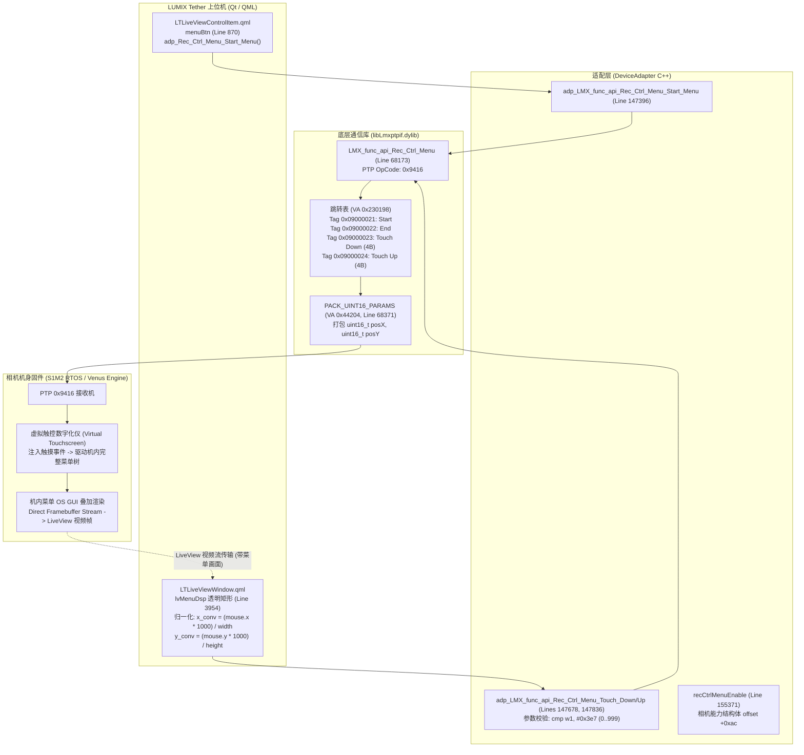

# LUMIX S1M2 远程菜单协议（Remote Menu Operation）深度逆向与离线静态审计报告


> **配套交付数据结构**：[`analysis/lumix_remote_menu_map.json`](file://<LOCAL_WORKSPACE>/analysis/lumix_remote_menu_map.json)

---

## 一、 核心结论与执行摘要

针对官方技术规格表中“DC-S1M2 / S5M2X / BS1H 支持远程 Menu operation”这一关键入口，本轮逆向深度追踪了 LUMIX Tether 2.12 底层通信库（`libLmxptpif.dylib`）、中间适配层（`DeviceAdapter`）以及 QML 用户界面源码，得出如下定性与定量结论：



1. **协议性质定性：虚拟触控中继，非结构化参数树，亦非物理按键仿真**：
   - 官方所谓“Menu operation”，**既不是**类似于 PTP Property 的结构化菜单项读取与设置，**也不是**上/下/左/右/Menu/Set 离散实体物理按键仿真。
   - 其真实实现是：**基于 LiveView 视频流叠加的 1000×1000 归一化虚拟触控数字化仪中继协议（Virtual Touchscreen Coordinate Relay）**。
   - 相机在收到进入菜单指令后，自身切换为 `CamStatus_Menu_Displayed` 状态，机身 Venus Engine GUI 系统将完整的相机原生设置菜单直接光栅化绘制在 LiveView 图像画面上。
2. **离线静态字典情况：上位机 100% 菜单内容无关（Menu-Agnostic）**：
   - 上位机 Tether 2.12 内**完全不存在**任何机内菜单项 ID、菜单树拓扑结构、可用性标志、候选值列表、字符串表或序列化资源文件。
   - 客户端不需要知道点选的是“高分辨率”还是“白平衡”，一切菜单逻辑、层级跳转与互锁均由机身端 RTOS 内部处理。
   - 真正的离线结构化配置数据载体，并不在 Remote Menu 协议内，而是在全量配置转储通道 **PTP OpCode `0x9422`**（`.DAT`/`.CAM` 记录流）中。

---

## 二、 协议接口解构与精确汇编实证

### 1. 底层通信库：`libLmxptpif.dylib` 核心入口与数据布局

#### (1) `LMX_func_api_Rec_Ctrl_Menu`
- **函数符号**：`__Z26LMX_func_api_Rec_Ctrl_MenuP24_tag_LMX_STRUCT_REC_CTRLPcPj`
- **反汇编位置**：[`tether_2_12_ptp_arm64_disassembly.txt` 行 68173-68212](file://<LOCAL_WORKSPACE>/analysis/tether_2_12_ptp_arm64_disassembly.txt#L68173-L68212)
- **底层 PTP OpCode**：
  ```armasm
  68192: 0000000000043f3c    mov    w0, #0x9416
  68193: 0000000000043f40    mov    x1, x21      ; struct _tag_LMX_STRUCT_REC_CTRL*
  68194: 0000000000043f44    mov    x2, x19      ; camera_id
  68195: 0000000000043f48    bl     __Z39Lmx_lib_ptpif_LmxExt_Rec_Ctrl_with_datajP24_tag_LMX_STRUCT_REC_CTRLPc
  ```
  明确使用 Vendor 专有扩展操作码 **`0x9416`**。

- **输入参数结构体 `_tag_LMX_STRUCT_REC_CTRL` 内存布局**：
  | 偏移 | 字段类型 | 字段含义 | 说明 |
  | :--- | :--- | :--- | :--- |
  | `+0x00` | `uint32_t` | `tag` | 子命令标识（例如 `0x09000021` ~ `0x09000024`） |
  | `+0x04` | `uint16_t` | `param_count` | 附属参数个数（无参数为 0，触控为 2） |
  | `+0x06` | `uint16_t` | `padding` | 内存对齐填充 |
  | `+0x08` | `uint32_t[]` | `params` | 存储参数值数组（触控时为 `params[0] = posX`, `params[1] = posY`） |

- **跳转分发驱动表（Dispatch Table at VA `0x230198`）**：
  在 `libLmxptpif.dylib` 常量数据段（VA `0x230198`，[`tether_2_12_ptp_arm64_disassembly.txt` 行 67351-67363](file://<LOCAL_WORKSPACE>/analysis/tether_2_12_ptp_arm64_disassembly.txt#L67351-L67363)），定义了 58 组 `Rec_Ctrl` 标签表项。其中远程菜单子项映射如下：
  | 索引 | Tag 标签 | 载荷长度 | 序列化处理函数指针 | 功能语义 |
  | :--- | :--- | :--- | :--- | :--- |
  | `[48]` | `0x09000021` | 0 字节 | `0x44230` (`LmxExt_TBD_NOP`) | **Start_Menu**：通知机身启动菜单显示 |
  | `[49]` | `0x09000022` | 0 字节 | `0x44230` (`LmxExt_TBD_NOP`) | **End_Menu**：通知机身退出菜单显示 |
  | `[50]` | `0x09000023` | 4 字节 | `0x44204` (`PACK_UINT16_PARAMS`) | **Touch_Down_Menu**：触控按下 |
  | `[51]` | `0x09000024` | 4 字节 | `0x44204` (`PACK_UINT16_PARAMS`) | **Touch_Up_Menu**：触控释放 |

- **序列化封包函数逻辑**：
  [`tether_2_12_ptp_arm64_disassembly.txt` 行 68371-68382](file://<LOCAL_WORKSPACE>/analysis/tether_2_12_ptp_arm64_disassembly.txt#L68371-L68382)（`__ZL43Lmx_lib_ptpif_LmxExt_TBD_PACK_UINT16_PARAMS`）：
  ```armasm
  68372: 0000000000044204    ldrh   w8, [x1, #0x4]        ; 读取 param_count (2)
  68373: 0000000000044208    cbz    w8, 0x4422c
  68374: 000000000004420c    mov    x8, #0x0
  68375: 0000000000044210    add    x9, x1, #0x8          ; x9 指向 params 数组首地址
  68376: 0000000000044214    ldr    w10, [x9, x8, lsl #2] ; 读取 32位坐标值 (posX/posY)
  68377: 0000000000044218    strh   w10, [x0, x8, lsl #1] ; 截断并打包为 16位小端整数存入发送缓冲区
  68378: 000000000004421c    add    x8, x8, #0x1
  68379: 0000000000044220    ldrh   w10, [x1, #0x4]
  68380: 0000000000044224    cmp    x8, x10
  68381: 0000000000044228    b.lo   0x44214
  ```
  证实：PTP 报文实际发送的载荷为 **4 字节二进制流**，格式为 `[uint16_t posX][uint16_t posY]`。

#### (2) `LMX_func_api_Setup_Ctrl_MenuSave` 语义澄清
- **函数符号**：`__Z32LMX_func_api_Setup_Ctrl_MenuSavePcPj`
- **反汇编位置**：[`tether_2_12_ptp_arm64_disassembly.txt` 行 48025-48063](file://<LOCAL_WORKSPACE>/analysis/tether_2_12_ptp_arm64_disassembly.txt#L48025-L48063)
- **底层通信**：Tag `0x09000011`，PTP OpCode **`0x9406`**（Setup Control），调用 `Lmx_lib_ptpif_LmxExt_Setup_Ctrl`。
- **调用溯源**：在客户端中，该接口唯一的调用链位于 [`tether_2_12_app_arm64_disassembly.txt` 行 43433](file://<LOCAL_WORKSPACE>/analysis/tether_2_12_app_arm64_disassembly.txt#L43433)，处于 `DeviceAdapter::adp_LMX_func_api_Power_SavingInfo_Set_Tether_Connect_Mode` 函数内。
- **语义定性**：此处的“MenuSave”并非远程菜单的界面的“保存”，而是机身设置存储区的**持久化提交指令（Flash Commit）**，其作用是将当前修改的省电联机设置固化写入机身非易失性存储器（NVRAM/EEPROM）。

---

### 2. 客户端中间适配层：`DeviceAdapter` 封装逻辑

#### (1) 四大核心 Q_INVOKABLE 方法
在 [`tether_2_12_app_arm64_disassembly.txt`](file://<LOCAL_WORKSPACE>/analysis/tether_2_12_app_arm64_disassembly.txt) 中，`DeviceAdapter` 对外封装了 4 个槽函数：
1. **`adp_LMX_func_api_Rec_Ctrl_Menu_Start_Menu`**（行 147396-147500）：
   - 构造结构体：`sp[0x50] = 0x09000021`（Tag），`sp[0x54] = 0`（Param Count）。
   - 互斥加锁：`dev_mutex_lock`（行 147427）。
   - 调用底层：`LMX_func_api_Rec_Ctrl_Menu`（行 147454）。
2. **`adp_LMX_func_api_Rec_Ctrl_Menu_End_Menu`**（行 147544-147648）：
   - 构造结构体：`sp[0x50] = 0x09000022`（Tag），`sp[0x54] = 0`。
   - 调用底层：`LMX_func_api_Rec_Ctrl_Menu`（行 147610）。
3. **`adp_LMX_func_api_Rec_Ctrl_Menu_Touch_Down_Menu(int posX, int posY)`**（行 147678-147792）：
   - **严格的坐标范围前置校验**：
     ```armasm
     147686: 00000001000982bc    cmp    w1, #0x3e7    ; 校验 posX <= 999 (0x3e7)
     147687: 00000001000982c0    b.hi   0x10009844c   ; 超出 999 直接退出返回 0
     147688: 00000001000982c4    mov    x19, x2
     147689: 00000001000982c8    tbnz   w2, #0x1f, 0x10009844c ; 校验 posY >= 0
     ```
   - 构造结构体：`sp[0x50] = 0x09000023`，`sp[0x54] = 2`（Count），`sp[0x58] = posX`，`sp[0x5c] = posY`。
   - 调用底层：`LMX_func_api_Rec_Ctrl_Menu`（行 147745）。
4. **`adp_LMX_func_api_Rec_Ctrl_Menu_Touch_Up_Menu(int posX, int posY)`**（行 147836-147950）：
   - 同样进行 `0..999` 范围校验，构造 `Tag = 0x09000024`，`Count = 2`，参数装填 posX、posY 后调用底层（行 147903）。

#### (2) 机身能力启用标记 `recCtrlMenuEnable`
- **属性定义**：
  - Getter：`recCtrlMenuEnable()`（行 155371，`qt_metacall` 读取槽位于行 250386）。
  - Setter：`setRecCtrlMenuEnable(bool)`（行 41595）。
  - 信号：`recCtrlMenuEnableChanged(bool)`（行 273597）。
- **判定逻辑**（行 36197-36225，`setCameraInfoOfSelectedCamera`）：
  - 当上位机识别并选中连接相机时，从底层查询的机身能力描述符偏移 `+0xac`（栈地址 `[sp, #0x1fc]`）提取 1 字节布尔标志：
    若为 1 则将内部属性置 1，并触发 `recCtrlMenuEnableChanged(true)`。
  - 该判断与原厂规格说明文档 [`sources/lumixtether_supported_functions.html`](file://<LOCAL_WORKSPACE>/analysis/sources/lumixtether_supported_functions.html) 完全吻合：只有 **S1M2 / S1M2ES / S1RM2 / S5M2X / BS1H** 返回支持，传统机型（S1/S1R/S1H/S5/S5M2/GH5/G9 等）此位均置 0。

---

### 3. UI 表现与触控坐标转换：原厂 QML 源码实证

通过对解包后 Qt 嵌入资源（`qInitResources_src_qml`）的 zlib 解压缩审计，提取到了完整的 QML 交互源码：

#### (1) 菜单按钮控制与状态感知：[`LTLiveViewControlItem.qml`](file://<LOCAL_WORKSPACE>/analysis/sources/tether_2_12_expanded/LUMIXTether.pkg/Payload/LUMIX%20Tether.app/Contents/MacOS/LUMIX%20Tether)
- **按钮显隐受控**（行 3000-3006）：
  ```qml
  if (deviceAdapter.recCtrlMenuEnable) {
      menuBtn.visible = true;
      item1Height += btnHeight_normal + 1;
      item1Rows += 1;
  }
  ```
- **按钮点击触发**（行 882-912）：
  ```qml
  id: menuBtn
  buttonText: qsTr("MENU")
  onClicked: {
      if (checked) {
          checked = false;
          ret = deviceAdapter.adp_LMX_func_api_Rec_Ctrl_Menu_Start_Menu();
      } else {
          checked = true;
          ret = deviceAdapter.adp_LMX_func_api_Rec_Ctrl_Menu_End_Menu();
      }
  }
  ```
- **机身状态监听**（行 914-925）：
  监听机身状态通知，当 `deviceAdapter.cameraStatus === LT.Utilities.CamStatus_Menu_Displayed` 时，锁定其他常规拍摄控件，维持菜单状态。

#### (2) 实时触控坐标转换与下发：[`LTLiveViewWindow.qml`](file://<LOCAL_WORKSPACE>/analysis/sources/tether_2_12_expanded/LUMIXTether.pkg/Payload/LUMIX%20Tether.app/Contents/MacOS/LUMIX%20Tether)
在取景画面组件上方，定义了跟随 LiveView 视频有效区域尺寸变换的透明矩形（行 3954-3975）：
```qml
Rectangle {
    id: lvMenuDsp
    x: imageLV.x + imageLV.width / 2 - imageLV.paintedWidth / 2
    y: imageLV.y + imageLV.height / 2 - imageLV.paintedHeight / 2
    width: imageLV.paintedWidth
    height: imageLV.paintedHeight
    color: "transparent"
    visible: (deviceAdapter.cameraStatus == LT.Utilities.CamStatus_Menu_Displayed)
    rotation: (lv_rotation_mode)? lv_rotation_auto: lv_rotation

    MouseArea {
        anchors.fill: parent
        onClicked: (mouse) => {
            if (deviceAdapter.cameraStatus == LT.Utilities.CamStatus_Menu_Displayed) {
                // 将鼠标相对于取景画面的像素点击位置，精确归一化为 0..1000 范围
                var x_conv = parseInt( (mouse.x * 1000) / lvMenuDsp.width )
                var y_conv = parseInt( (mouse.y * 1000) / lvMenuDsp.height )

                // 成对发送 Touch Down 与 Touch Up 模拟一次完整点击
                deviceAdapter.adp_LMX_func_api_Rec_Ctrl_Menu_Touch_Down_Menu(x_conv, y_conv);
                deviceAdapter.adp_LMX_func_api_Rec_Ctrl_Menu_Touch_Up_Menu(x_conv, y_conv);
            }
        }
    }
}
```
**关键发现**：上位机在此处完成了整个操作的所有逻辑。上位机根本不知道点选的是屏幕上的哪个图标或哪行字，它只把点击点在取景器中的相对百分比（千分比）作为虚拟触控坐标传递给机身。

---

