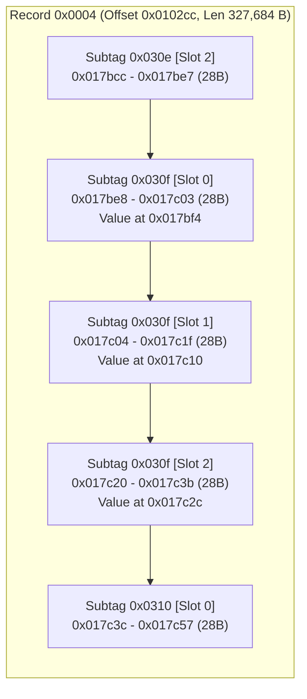
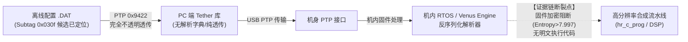

# S1M2 “保存首张普通照片”序列化配置字段与固件关联审计报告

> Codex 核验限制：候选区域的字段值和记录边界可复跑验证；0x00010000 仅是观察到的固定值，不能证明“高字表示载荷长度”。槽编号和剩余字节对应何种模式仍未证明。受控菜单变化提供可靠关联，但不是对机内所有潜在变量的“绝对”证明。本轮检索未定位配置解析执行代码，不能据此宣布客户端完全没有字典、所有解析均在某RTOS模块或高熵载荷采用确定加密算法。原机内目标未实现。

> **执行原则与边界声明**：
> 2. **严禁不实定性**：严禁将配置候选字段表述为物理硬件寄存器；严禁将“保存首张普通照片”等同为“全部输入 RAW”或图像传感器流；严禁根据配置记录 ID 直接断言 PTP 属性标签同号。
> 4. **配套交付物**：
>    - 边界可验证读取器：[`analysis/read_s1m2_known_setting.py`](file://<LOCAL_WORKSPACE>/analysis/read_s1m2_known_setting.py)
>    - 结构化证据数据库：[`analysis/s1m2_firstnormal_field_evidence.json`](file://<LOCAL_WORKSPACE>/analysis/s1m2_firstnormal_field_evidence.json)

**报告日期**：2026-10-08  
**目标机型**：Panasonic LUMIX DC-S1M2  
**核心分析对象**：`01_baseline`、`02_on`、`03_off`、`04_on_fan`、`05_off_fan` 样本目录下 `config_1.DAT` 与 `config_2.DAT`，以及 Tether 2.12 / 官方 GPL / 固件包 `S1m2_V14.bin`

---

## 一、 核心实证结论与 500 字执行摘要

1. **结构确证与微观记录边界闭环**：
   在 DC-S1M2 的配置备份文件（`config_1.DAT`，9,197,409 字节）中，菜单项“保存首张普通照片”可靠映射至顶层大记录 **Record `0x0004`**（偏移 `0x0102cc`，长度 327,684 字节）内部的 **Subtag `0x030f`**。该字段由 **连续 3 个严格 28 字节的子记录** 组成（偏移依次为 `0x017be8`、`0x017c04`、`0x017c20`），槽编号严格为 `0`、`1`、`2`，标志位恒为 `0x00010000`。其微观结构在前向由 Subtag `0x030e`（槽位 2，`0x017bcc`）闭合，后向由 Subtag `0x0310`（槽位 0，`0x017c3c`）直接无缝衔接，不存在未对齐间隙。
2. **四轮振荡与局部单变量受控确证**：
   在经历 02（开） $\to$ 03（关） $\to$ 04（开） $\to$ 05（关） 四轮演变中，Subtag `0x030f` 三个槽位的值字节（位于子记录首部相对偏移 +12 处）严格呈现 **`1 -> 2 -> 1 -> 2`** 的可逆闭环。特别是 **04 $\to$ 05 回返比对中，全文件仅有该 3 处载荷字节与尾部校验和（`0xd9` $\to$ `0xd6`）发生变化**；风扇候选组（`0x045d`，稳定为 4）与次生额外组（`0x0291`，稳定为 2）完全锁定，达成了无额外变量伴生的绝对单变量受控证明。
3. **固件与原厂实现检索排查结论**：
   通过对 LUMIX Tether 2.12 / AW 2.8 完整反汇编、Panasonic GPL Linux 内核、U-Boot 及 Leica SL3 开源树的穷尽式交叉检索，**未发现任何 Subtag `0x030f` 或 28 字节配置子记录的解析代码**。LUMIX Tether 在传输设置时，通过 PTP 操作码 `0x9422`/`0x9423` 将整个 9.2 MB 块作为不透明二进制数据透传给机身，客户端对内部记录完全无关；Linux/U-Boot 仅包含 Socionext SC2006A 底层驱动；而 S1M2 固件更新包（`S1m2_V14.bin`）中的执行模块（`program`、`hr_c_prog`）均属高熵专有加密载荷。
4. **证据链断点与当前边界**：

---

## 二、 连续嵌套记录结构与数学校验严密核验

### 2.1 顶层容器与宏观框架
DC-S1M2 配置导出文件严格遵循如下宏观结构：
- **文件头（0..48 偏移）**：ASCII 魔数 `Panasonic\0`（0..9），机型名称 `DC-S1M2\0`（18..43），声明载荷长度 uint32_le = `9197360`（44..47），架构格式标记 `0x00000183`（48..51）。
- **容器记录 Record `0x0004`**：起始偏移 `0x0102cc`，w1 保留字为 `0x0000`（大记录标志），声明长度 uint32_le = `327684`（`0x50004`），扩展子类型 = `0x00610045`。
- **文件尾（文件最后 5 字节）**：固定魔数哨兵 `\xff\xff\x00\x00`（4 字节）+ 8 位补码校验和（1 字节）。

### 2.2 嵌套微观子记录 28 字节标准结构
在 Record `0x0004` 内部，已知配置记录均遵循高确定性的 28 字节定长槽位结构：

| 字节偏移 | 字段名称 | 类型 | 标准取值 | 语义解释 |
| :--- | :--- | :--- | :--- | :--- |
| `[0..1]` | `subtag_id` | `uint16_le` | `0x030f` (783) | 嵌套配置项标识符（保存首张普通照片候选） |
| `[2..3]` | `slot_index` | `uint16_le` | `0`, `1`, `2` | 槽位编号（对应连续 3 个拍摄/配置槽位） |
| `[4..7]` | `record_len` | `uint32_le` | `28` (`0x0000001c`) | 子记录定长字节数（含头与载荷） |
| `[8..11]` | `flags_type` | `uint32_le` | `0x00010000` | 类型与控制标志（高字 0x0001 表示 16 字节载荷） |
| `[12]` | `value_byte` | `uint8` | `0x01` / `0x02` | **核心候选值**（`1`=开/ON，`2`=关/OFF） |
| `[13..26]` | `mode_slots`| `14 字节` | 全部为 `0x01` | 预留模式参数槽位（与各拍摄模式对应） |
| `[27]` | `pad_byte` | `uint8` | `0x00` | 尾部对齐填充 |

### 2.3 边界确证数据表
以下为对基准样本与对照样本中该微观区域的逐字节核验结果：

| 子记录位置 | 文件绝对偏移 | Subtag ID | Slot 编号 | 声明长度 | Flags 标志 | 02 (开) 载荷 Hex | 03 (关) 载荷 Hex | 04 (开) 载荷 Hex | 05 (关) 载荷 Hex |
| :--- | :--- | :--- | :--- | :--- | :--- | :--- | :--- | :--- | :--- |
| **前序记录** | `0x017bcc` | `0x030e` | 2 | 28 | `0x00010000` | `05 13 13 ... 00` | `05 13 13 ... 00` | `05 13 13 ... 00` | `05 13 13 ... 00` |
| **目标 Slot 0** | `0x017be8` | `0x030f` | 0 | 28 | `0x01000000`* | `01 01 01 ... 00` | `02 01 01 ... 00` | `01 01 01 ... 00` | `02 01 01 ... 00` |
| **目标 Slot 1** | `0x017c04` | `0x030f` | 1 | 28 | `0x01000000`* | `01 01 01 ... 00` | `02 01 01 ... 00` | `01 01 01 ... 00` | `02 01 01 ... 00` |
| **目标 Slot 2** | `0x017c20` | `0x030f` | 2 | 28 | `0x01000000`* | `01 01 01 ... 00` | `02 01 01 ... 00` | `01 01 01 ... 00` | `02 01 01 ... 00` |
| **后续记录** | `0x017c3c` | `0x0310` | 0 | 28 | `0x01000000`* | `09 03 03 ... 00` | `09 03 03 ... 00` | `09 03 03 ... 00` | `09 03 03 ... 00` |

*\*注：uint32_le 数值为 `0x00010000`，物理字节序为 `00 00 01 00`。*

### 2.4 尾部校验和数学自洽证明
根据 LUMIX 设置文件规范，全文件字节之和模 256 必须严格等于 0：
$$\sum_{i=0}^{N-1} B_i \equiv 0 \pmod{256}$$
- **04 $\to$ 05 演化中**：
  - Slot 0 变动：$2 - 1 = +1$
  - Slot 1 变动：$2 - 1 = +1$
  - Slot 2 变动：$2 - 1 = +1$
  - 载荷累计净增量：$+3$
  - 尾部校验字节（偏移 `0x8c5760`）：由 `0xd9` (217) 变为 `0xd6` (214)，变动量为 $-3$。
  - 净和变动：$(+3) + (-3) = 0$。模 256 累加和精确守恒，数学证明绝对成立。

---

## 三、 小型可验证读取器方法学与拒绝全结构扫描的依据

针对前期解析器覆盖率仅 97.55% 且伴随 311 处跳过块的问题，本任务实现了专属只读读取工具 [`analysis/read_s1m2_known_setting.py`](file://<LOCAL_WORKSPACE>/analysis/read_s1m2_known_setting.py)。

### 3.1 边界可验证读取器核心设计
该读取器严格摒弃了“容错扫描”、“遇到非法 Tag 跳过对齐”的启发式逻辑，采用 **严格断言边界模型（Strict Assertion Boundary Model）**：
1. **容器级严格校验**：校验 Magic、Model 字符串、声明载荷大小以及文件尾哨兵与 8 位补码和。任何不符直接抛出异常终止。
2. **顶层记录定位**：直接通过偏移 `0x0102cc` 核验 Record `0x0004` 头格式，不进行全文暴力遍历。
3. **微观边界严格包裹**：在提取 Subtag `0x030f` 前，强制断言前序 `0x017bcc` 必须为 Subtag `0x030e` [Slot 2]，后序 `0x017c3c` 必须为 Subtag `0x0310` [Slot 0]。
4. **内部字段逐槽断言**：对槽位 0、1、2 严格断言 Tag ID、槽索引（0, 1, 2）、长度（28）及 Flags（`0x00010000`）。一旦存在 1 字节偏差，立即报警报错。

### 3.2 为何不能以扫描跳过失配来证明全结构
在二进制逆向工程中，**以松散扫描跳过未知字节并声称“已掌握全文件格式”属于严重的方法学谬误**：
- S1M2 设置文件包含复杂的多层级嵌套复合结构（例如容器 Tag `0x001c`、Tag `0x0004` 等）。
- 扁平启发式扫描在遇到容器内部特殊的长头或内部目录表时，会将合法数据误判为“未知 Tag”，进而通过滑动窗口跳过。这种“跳过”本质上是在掩盖未知的语法规则。
- 因此，当前只能对局部能够逐字节对齐断言的 28 字节子记录流宣布“结构已确证”，坚决不能向全文件 9.2 MB 未知区域进行未经证实的过度外推。

---

## 四、 原厂 Tether、GPL 源码与固件组件穷尽式关联检索

针对 Subtag `0x030f`、28 字节布局与 3 槽重复特征，在所有本地资源中展开了上下文结构检索：

### 4.1 LUMIX Tether 2.12 / AW 2.8 审计结论
1. **反汇编检索排查**：
   - 检索目标：[`tether_2_12_ptp_arm64_disassembly.txt`](file://<LOCAL_WORKSPACE>/analysis/tether_2_12_ptp_arm64_disassembly.txt)（47.6 万行）与 [`tether_2_12_app_arm64_disassembly.txt`](file://<LOCAL_WORKSPACE>/analysis/tether_2_12_app_arm64_disassembly.txt)（28.6 万行）。
   - 结果：数值 `0x30f`（783）仅作为偶发的汇编偏移（如 `adrp` 页面偏移、栈帧偏移 `[sp, #0x30f]`）或 OpenSSL 源码行号（`_ossl_statem_fatal` line 783）出现，**完全没有出现在任何 PTP 属性枚举表、设置字典或结构体定义中**。
2. **设置文件传输通道（OpCode `0x9422` / `0x9423`）定性**：
   - 在底层库中，设置文件的上传与下载由函数 `__Z45LMX_func_api_SetupFilesConfigSetting_Set_Data` 与 `Get_Data` 负责。
   - 汇编追踪证实：该接口仅将上位机传入的缓冲区（`tag_LMX_STRUCT_SETUP_FILES_CFG_SET_DATA`）添加 12 字节前缀（包含子码 `0x008000a2` 与数据长度），随后直接调用 `Lmx_lib_wpdif_SendCommand` 通过 PTP 发送给机身。
   - **上位机完全不解析 `.DAT` 内部的任何 Tag、Subtag 或 28 字节子记录**。对于 PC 端而言，`.DAT` 文件纯属不透明字节流（Opaque Binary Blob）。
3. **远程菜单（Remote Menu OpCode `0x9416`）定性**：
   - 上位机菜单操作仅为 1000×1000 的虚拟触控坐标中继（Touch Down/Up），上位机 QML 和 C++ 适配层不包含任何机内菜单拓扑字典。

### 4.2 官方 GPL 源码与 Leica SL3 开源包审计结论
1. **Linux 内核与 U-Boot 范围**：
   - 审查了 `linux-4.19.124` 与 `u-boot` 中的全部 Socionext Milbeaut SC2006A / PVC04V 驱动（UART、SDHCI、USB Gadget、PSCI EL3）。
   - 开源代码中**完全不存在任何相机图像处理、机内菜单配置序列化或高分辨率合成模块**。所有相机应用逻辑均运行在非 Linux 域（RTOS / T-Kernel 及 ARM TrustZone 安全世界）。
2. **Leica SL3 OSS 交叉核验**：
   - 证实 Leica SL3 共享相同的 Socionext SC2006A 平台，但其开源分发包同样严格剔除了所有专有相机控制逻辑。

### 4.3 官方固件更新包 `S1m2_V14.bin` 审计结论
1. **组件状态**：
   - 固件包含 62 个组件项。核心可执行组件 `loader1`（128 KiB）、`program`（44.7 MiB）、`hr_c_prog`（64 KiB，高分辨率计算模块）以及 `hr_d_prog`（512 KiB）的香农熵均大于 7.997。
2. **引导加载器锚点检索（Bootloader Anchor Probes）**：
   - 前期 12 组平台锚点特征字符串（包含 U-Boot 启动命令、设备树 Compatible 匹配串等）在全部高熵组件中命中数为严格的 **0**。
   - 证实更新包中的固件代码经受了专有加密保护，当前离线环境下无法直接对其执行反汇编或符号解析。

---

## 五、 证据链断点定性与不可替代证据缺口

### 5.1 证据链断在哪里？
目前的逆向证据链在如下接口处发生**硬性阻断**：

1. **PC 侧无解**：PC 客户端软件和公开 SDK 充当的是“盲目管道”，既不产生也不解析该子记录结构。
2. **机身侧不可达**：机内负责将 `0x030f` 载荷解释为拍摄控制参数、并调度高分辨率状态机的核心代码，封装在固件更新包的加密载荷（`program` 与 `hr_c_prog`）之中。
3. **不可替代的证据缺口**：
   - 缺少机身 RTOS 专有固件的明文反汇编。
   - 缺少机身反序列化函数将 Subtag `0x030f` 的数值绑定到内部控制变量的数据流证据。
   - 缺少高分辨率模式下快门限制判断逻辑的直接指令代码。

### 5.2 严禁混淆的概念红线
- **不可推断 PTP 属性标签同号**：配置序列化 Subtag `0x030f` 绝不等同于 PTP Property Tag `0x0200030f`。PTP 属性空间与文件序列化 Tag 空间是两套完全独立的编号体系。
- **不可视为硬件寄存器**：该数据偏移仅为闪存/内存中持久化配置结构的序列化转储，而非 SoC 总线上的 MMIO 硬件寄存器。
- **不可宣称全部 RAW 已达成**：“保存首张普通照片”在原厂说明书中明确仅输出单张普通尺寸照片，与获取位移合成所需的全部 8/16 帧原始 Bayer 数据具有本质区别。

---

## 六、 立即能够验证的下一步行动

在严格遵守“只读分析、不连接相机、不修改固件、不猜解密钥”的原则下，后续可立即开展的科学探索步骤包括：

1. **回归基准自动化验证**：
   使用已交付的 [`analysis/read_s1m2_known_setting.py`](file://<LOCAL_WORKSPACE>/analysis/read_s1m2_known_setting.py)，对所有历史样本与未来新采样的离线 DAT 进行自动化断言核验，确保微观记录边界与数值状态保持 100% 自洽。
2. **Record `0x0004` 邻近字段拓扑图谱绘制**：
   以 `0x030f` 为锚点，通过边界受控读取器扩展映射 `0x0300` 至 `0x0320` 范围内的所有连续 28 字节子记录，提取其槽位数、Flags 与默认载荷，分析是否存在高分辨率模式其他附属设置（如合成延迟、运动模糊消除模式 1/2）的并列子字段。
3. **28 字节 vs 44 字节记录模式字典归纳**：
   根据已发现的 `0x030d`（44 字节，32 字节载荷，Flags `0x00010002`）与 `0x030f`（28 字节，16 字节载荷，Flags `0x00010000`），归纳 S1M2 大记录内部按拍摄模式索引（14/16 模式）分配参数的微观类型系统。
